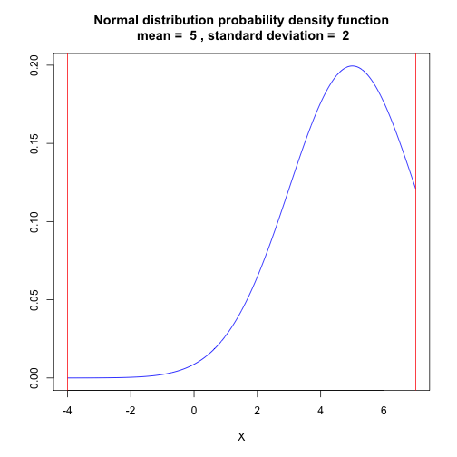

Normal distribution a Shiny application by
========================================================
author: Damien Sonnerat
date: November 20th 2015

What does the application
========================================================
<small>
This application allows you to specify normal distribution mean and standard deviation.
You also have to give an interval. The normal distribution probability density function
calculated within the interval is then plotted and the probability to have a value
within this interval is also calculated.

To make it work you have to:
 - Select the mean of the normal distribution.
 - Select the standard deviation or the normal distribution.
 - Select the min of the interval.
 - Select the max of the interval.
 
The système will automatically plot the normal distribution probability density function
and calculate the probability.

You can access the site using the following URL: [https://dsonnerat.shinyapps.io/shinyProject]
</small>

Plot caclulation
========================================================

<small>
Bellow R code that simulate input from the UI


```r
input <- data.frame(min=-4,max=7,mean=5, sd=2)
```

Bellow R code taken from server.R file. It plots the corresponding normal distribution probability density function.


```r
x <- seq(from=input$min, to = input$max, length.out = 1000)
plot(x=x, y=dnorm(x,mean=input$mean, sd = input$sd), type='l', main=paste('Normal distribution probability density function\n mean = ', input$mean , ', standard deviation = ', input$sd),
xlab='X',ylab='',col='blue')
abline(v=input$min, col='red')
abline(v=input$max, col='red')
```
</small>

Resulting plot
========================================================

 

Probability calculation
========================================================

<small>
Bellow R code taken from server.R file. It calculates the probability to have a value within the selected interval. 

```r
pnorm(q=input$max, mean=input$mean, sd=input$sd) - pnorm(q=input$min, mean=input$mean, sd=input$sd)
```

```
[1] 0.8413413
```
</small>

User help
<small>
- The check box 'Click to have some help on how to use this site.' allows the user to display documentation.
- Note also that if the user chooses a max value that is greater the the min value, the message 'Max value has to be greater than min value' is displayed.
</small>
